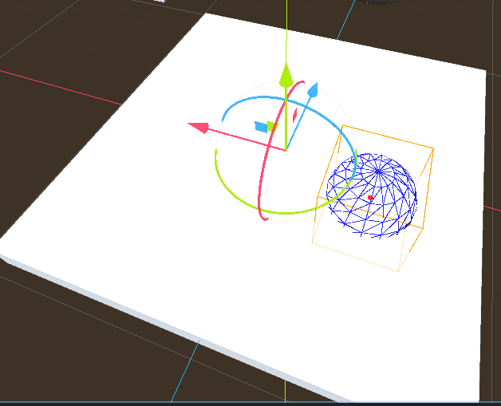
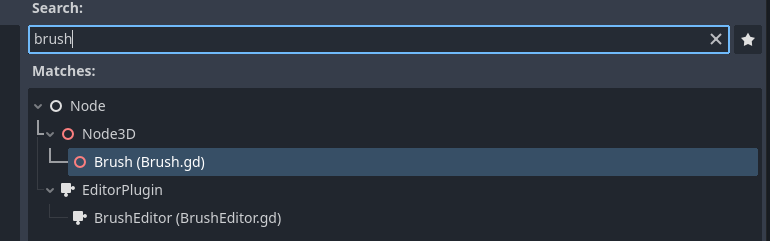

Scene Object brush is a 3D addon drawing tool for the [Godot game engine][god]. It's meant to ease the placement of scenes (ref Unity prefab drawers). I was not in a mood to do all the manual work to create a nice tree scenery, therefore i did what any sane (or not) developer would do - create a tool for that.

## How to use? 
1. import addon and enabled it under Godot Project Settings / Plugins
2. Add a Brush node to scene
3. Select Brush node (and optionally settings)
4. Use Left mouse button to place objects / Right Mouse button to erase them
5. Profit ? 

## Which Godot versions are supported ? 
Godot 4.0+ (could backport to Godot 3 LTS at some point)

## Are there bugs?
Most likely

## Will things change?
Definately

## Collaboration?
YES. Accepting pull requests

[god]: https://godotengine.org/
